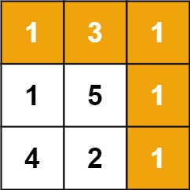

# Minimum Path Sum - Solution Explanation

## Problem Overview
Given an `m x n` grid filled with non-negative numbers, find a path from the top-left to the bottom-right corner that minimizes the sum of all numbers along its path. You can only move either down or right at any point in time.

## Visual Example
Consider the following 3×3 grid:




Our goal is to find the path from the top-left corner `(0,0)` to the bottom-right corner `(2,2)` that gives us the smallest possible sum.

## Approach: Dynamic Programming

### Intuition
For any cell `(i, j)` in our grid, the minimum path sum to reach it can only come from:
- The cell above it `(i-1, j)` (if we move down)
- The cell to its left `(i, j-1)` (if we move right)

This means we can build our solution step by step using dynamic programming.

### Algorithm Steps

1. **Initialization**: Create a DP table `minSums` with the same dimensions as our input grid
2. **Base Cases**:
   - Start cell `(0, 0)`: The minimum sum is simply `grid[0][0] = 1`
   - First column: Cells can only be reached by moving down from above
   - First row: Cells can only be reached by moving right from the left

3. **Recurrence Relation**:
    ```
    minSums[i][j] = grid[i][j] + min(minSums[i-1][j], minSums[i][j-1])
    ```
4. **Result**: The value at the bottom-right cell gives us our answer

### Step-by-Step Solution for Our Example

Let's trace through our example grid:

**Initial Grid:**


**Step 1: Initialize starting position**
    
```
minSums[0][0] = grid[0][0] = 1
```

**Step 2: Fill first row (moving right only)**

```
minSums[0][1] = grid[0][1] + minSums[0][0] = 3 + 1 = 4
minSums[0][2] = grid[0][2] + minSums[0][1] = 1 + 4 = 5
```

**Step 3: Fill first column (moving down only)**
```
minSums[1][0] = grid[1][0] + minSums[0][0] = 1 + 1 = 2
minSums[2][0] = grid[2][0] + minSums[1][0] = 4 + 2 = 6
```

**Step 4: Fill remaining cells using recurrence relation**

For `(1,1)`:
```
minSums[1][1] = grid[1][1] + min(minSums[0][1], minSums[1][0])
= 5 + min(4, 2) = 5 + 2 = 7
```


For `(1,2)`:
```
minSums[1][2] = grid[1][2] + min(minSums[0][2], minSums[1][1])
= 1 + min(5, 7) = 1 + 5 = 6
```

For `(2,1)`:
```
minSums[2][1] = grid[2][1] + min(minSums[1][1], minSums[2][0])
= 2 + min(7, 6) = 2 + 6 = 8
```

For `(2,2)`:
```
minSums[2][2] = grid[2][2] + min(minSums[1][2], minSums[2][1])
= 1 + min(6, 8) = 1 + 6 = 7
```

**Final DP Table:**
| | | |
|---|---|---|
| 1 | 4 | 5 |
| 2 | 7 | 6 |
| 6 | 8 | 7 |


### Result
The minimum path sum is **7**, which corresponds to the path: `1 → 1 → 1 → 1 → 1` (moving: right → down → right → down)

### Code Implementation

[2D DP Solution Code](./Solution.java)

### Complexity Analysis

Time Complexity: O(m × n) - We process each cell exactly once

Space Complexity: O(m × n) - We create a DP table of the same size as input

### Key Insight

The optimal path to any cell depends only on the optimal paths to the cell above it and to the cell to its left. This overlapping subproblem property makes dynamic programming the perfect approach for this problem.
### Alternative Optimizations

Space Optimization: The space complexity can be reduced to O(n) by only storing the current and previous rows:

[Optimized Solution made into 1D DP Problem](./SolutionOptimized.java)
